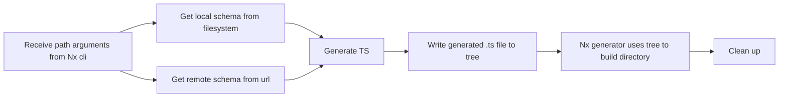

# OpenAPI REST Client Generator Nx Plugin

Generate typed REST clients from OpenAPI 3.0+ Specifications.

This plugin was generated with [Nx](https://nx.dev).

The openapi-plugin can create api clients based on local or remote schema files. The source files must be .yaml or .json and must adhere to the OpenAPI Specification 3.0+

## Usage

### Generating a new client

To build a new client in the clients folder:

- Run `nx g @aligent/nx-openapi:client`
- Follow the prompts to name and provide a source file

To build with flags (without needing to prompt):
Run `nx g @aligent/nx-openapi:client` with optional flags:

- `--name` Name of the api client.
- `--schemaPath` Absolute path to the schema. This can be a valid HTTP URL or a local file.
- `--importPath` The package name used to import the client. Defaults to `@clients/{name}` if not supplied
- `--configPath` path to the redocly config file responsible for authentication when fetching a schema remotely. For more information: https://openapi-ts.dev/cli#auth.
- `--skipValidate` If passed, this will skip schema pre-validation. Only do this if you have good reason to - not validating the schema beforehand may produce unpredictable results (either things may not generate at all or they may generate something that is incorrect).
- `--override` Override the schema (and the generated type) of an existing client.

**:rotating_light: Do not edit the files in the `/generated` folder after generating a client. These files are generated using the OpenAPI Schema and editing them may put you at risk of no longer conforming to the specifications of the API you are using! :rotating_light:**

### Regenerating types for an existing client

To regenerate an existing client run the same generator command again (as above) and pass in `--override` flag. If the client already exists, its types file will be regenerated from the provided one.

## Development

### Building

Run `nx run nx-openapi:build` to build the library.

### Running unit tests

Run `nx run nx-openapi:test` to execute the unit tests.

### Details

The plugin was created following the standards for Nx custom plugins. It contains a single `generator.ts` file which is responsible for the main logic behind generating the client.
For more information on client generation check [Nx plugin documentation](https://nx.dev/features/generate-code)

Normally, plugin generators take pre-defined files specified in the `/files` directory and automatically use that a basis for writing to a `Tree` object (the data structure Nx uses to generate files).

Since we are using `openapi-typescript` to generate files in real time, we can't create a pre-defined template. Instead perform write operations to the `Tree` ourselves. We do this by taking the output of the Typescript generation and calling a built in `write` process, to write the generated code into a file as part of the generation.

The flow for the generator is as follows:

## What gets generated?

The generator will generate two main things:

A `types` file that will contain several typescript interfaces depending on the OpenAPI schema specification it was passed:

- `paths`: Defines the routes that the API has as well as what parameters you can pass into them and what you should expect in return. [More information](https://swagger.io/docs/specification/v3_0/paths-and-operations/#paths)
- `operations`: The defined operations that can be performed on a given path. [More information.](https://swagger.io/docs/specification/v3_0/paths-and-operations/#operations)
- `components`: A way of avoid duplication when paths or operations contain the same structure in their responses. Components define a structure that is used multiple time throughout the API. [More information.](https://swagger.io/docs/specification/v3_0/components/)

A `client` file that will contain some commented, boilerplate code to help you get started.
